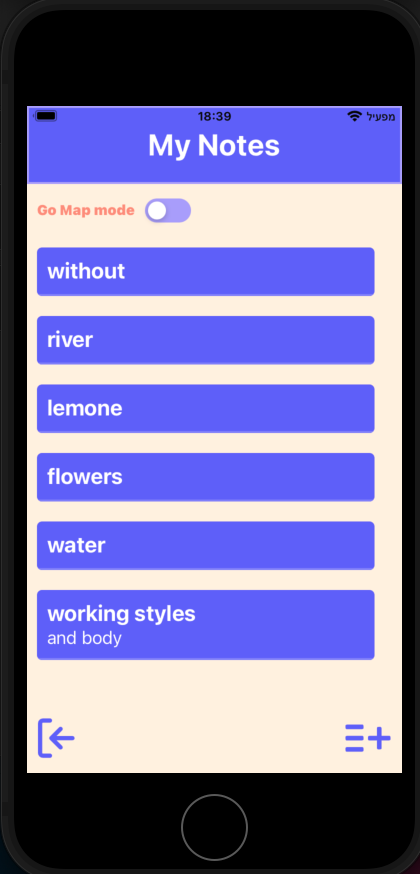
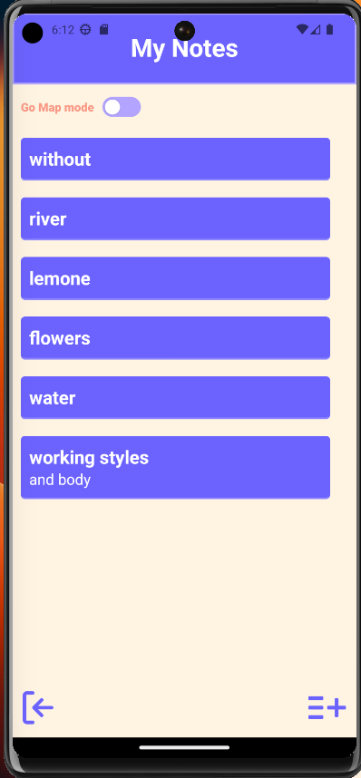
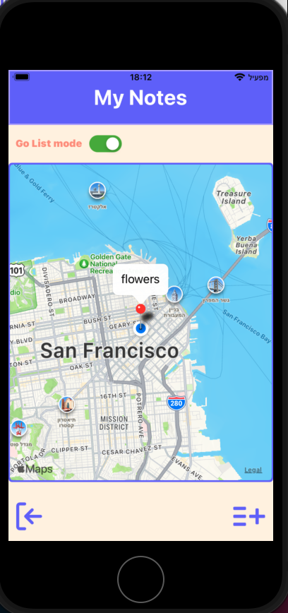
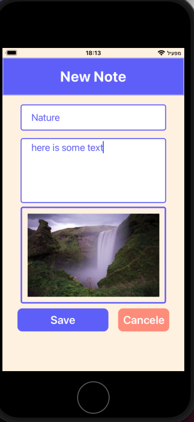
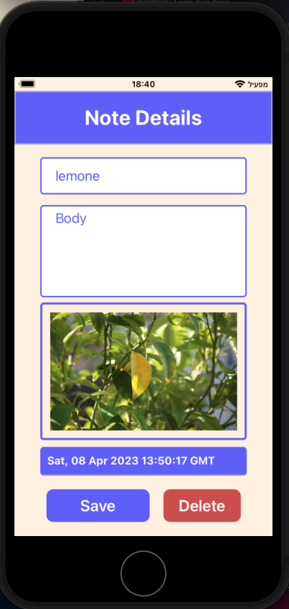

# notes-app
- React Native Expo App
- react-native version 0.71.6
- expo version 48.0.10

# Features
- The app can be run with all platfroms (IOS / Android)
- Login once, unit the user sign out.
- See notes of other users and there note's location on the map

# Install and Run the app
- download Expo go app from app store or google play
- node version >= 6.0.0
- clone the project
- `cd notes-app`
- make sure that the phone and the computer are connected to the same **wifi** (in case you are using physical device)
- `npm install`
- `npm run start` or `npm run tunnel`
- Scan the QR code above with Expo Go (Android) or the Camera app (iOS)
- Or run `i` to open ios simulator / `a` android emulator. 

# Tech
- React Native, Javascript
- Expo (MapView, ExpoLocation, ImagePicker)
- AsyncStorage
- Firebase

# Media

